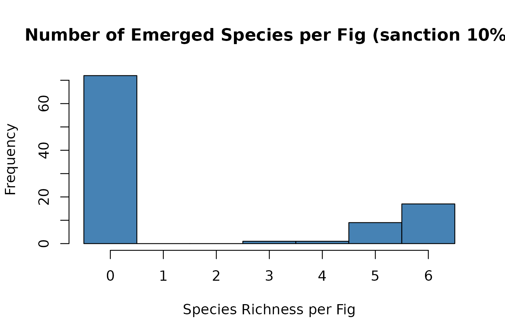
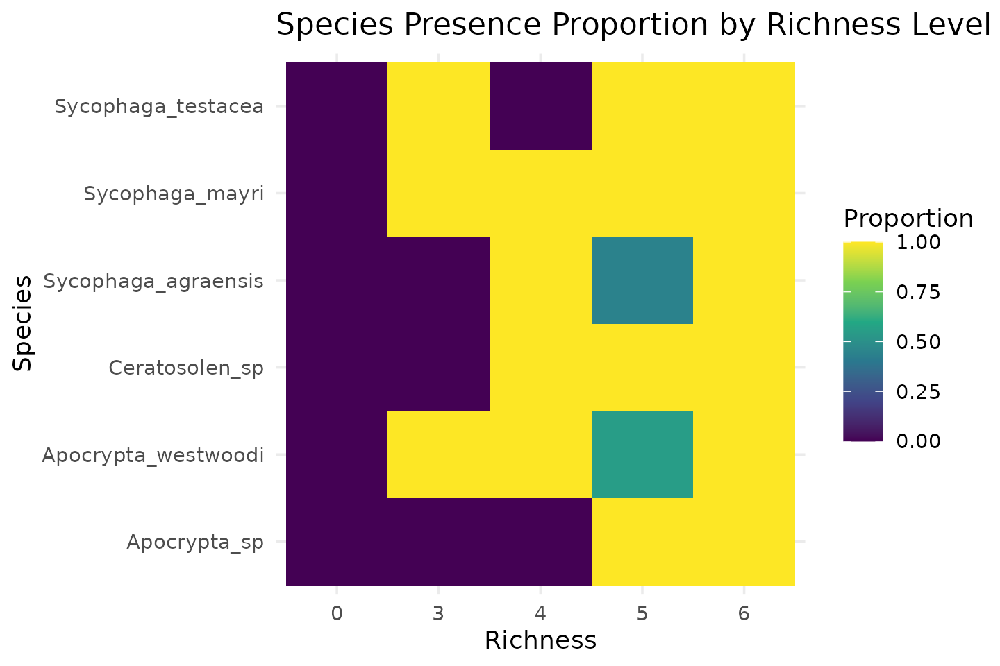

# figsimR: An R Package for Simulating Fig–wasp Community Dynamics

## 1. Introduction: When theory meets variability

Ecologists have long recognized that natural communities exhibit large
variability. `figsimR` operationalizes a mechanistic null workflow: we
calibrate a baseline configuration modeling (BCM) to reproduce empirical
means, then quantify the Variation Gap—the residual dispersion that the
intrinsic model cannot capture. Finally, we use mechanism knockout
experiments to dissect which internal processes maintain the theoretical
structure.

This vignette shows the full workflow on a fig–wasp case study, with
small defaults for speed. For the full reproduction (long runs), see the
package website article “Reproducing the case study” (or run this
vignette with `RUN_HEAVY <- TRUE`).

## 2. Data and quick look

We use an empirical dataset of fig wasp communities collected from
*Ficus racemosa*. Each column is a species’ abundance; each row is one
fig (community unit).

``` r

# Example data shipped with the package
data(observed_data)          # 935 x 6 abundance matrix (one row per fig)
data(parameter_list_default) # Named lists of biological parameters
data(species_list)           # Character vector of the six focal species

# Inspect the first rows
head(observed_data)
#>   Ceratosolen_sp Sycophaga_testacea Apocrypta_sp Sycophaga_mayri
#> 1           1163                  3            0               2
#> 2           1510                109            2              70
#> 3            744                102            0              39
#> 4           1494                  9            0               8
#> 5           1224                 10            0              42
#> 6            478                 77            1              97
#>   Sycophaga_agraensis Apocrypta_westwoodi
#> 1                  32                 189
#> 2                  22                  45
#> 3                  62                  12
#> 4                  54                  72
#> 5                  14                 103
#> 6                  39                  32
```

**Provenance.** Aung, K. M., Chen, H.-H., Segar, S. T., Miao, B.-G.,
Peng, Y.-Q., & Liu, C. (2022). *Journal of Animal Ecology*, 91,
1303–1315. <https://doi.org/10.1111/1365-2656.13701>

## 3. Build the theoretical world (BCM)

### 3.1 Bootstrap empirical metrics (fast)

We summarize alpha, beta, and simple network metrics by bootstrapping
figs. Defaults are small to keep this vignette snappy.

``` r

obs_metrics <- resample_observed_all_metrics(
  observed_df = observed_data,
  wasp_cols   = species_list,
  n_draws     = 10,     
  sample_n    = 50,    
  seed        = 42,
  calc_func   = calc_all_metrics
)

head(obs_metrics)
#>   mean_richness mean_shannon mean_simpson mean_evenness mean_bray_curtis
#> 1          4.58    0.7981529    0.4165617     0.5356446        0.6440074
#> 2          4.80    0.8352435    0.4314142     0.5451459        0.6199347
#> 3          4.60    0.7104973    0.3872805     0.4736846        0.6454684
#> 4          4.78    0.7881746    0.4040177     0.4984837        0.6524396
#> 5          5.24    0.8780027    0.4431855     0.5377353        0.6266425
#> 6          4.66    0.7462211    0.3876023     0.5170304        0.6432508
#>   mean_jaccard nestedness connectance links_per_species modularity   source
#> 1    0.3468435   36.17578   0.7633333          22.23144 0.08238783 Observed
#> 2    0.3114286   33.17945   0.8000000          23.06667 0.06452257 Observed
#> 3    0.3319586   37.81865   0.7823129          22.23478 0.07649338 Observed
#> 4    0.3219048   33.90781   0.7966667          22.97490 0.05664292 Observed
#> 5    0.2193333   34.82587   0.8733333          24.74809 0.04195560 Observed
#> 6    0.3497007   35.41562   0.7766667          22.51073 0.06978393 Observed
```

### 3.2 Parameter ranges for BCM calibration

We convert a parameter list into ranges for Latin hypercube exploration.
We remove fixed items (interaction matrix/weight).

``` r

param_ranges <- parameter_list_default
param_ranges[c("interaction_matrix", "interaction_weight")] <- NULL
param_ranges <- convert_parameter_list_to_param_ranges(param_ranges)
str(param_ranges, max.level = 1)
#> List of 60
#>  $ entry_mu_Sycophaga_testacea                         : num [1:2] 4.2 7.8
#>  $ entry_size_Sycophaga_testacea                       : num [1:2] 6.3 11.7
#>  $ fecundity_mean_Sycophaga_testacea                   : num [1:2] 15.4 28.6
#>  $ fecundity_dispersion_Sycophaga_testacea             : num [1:2] 1.05 1.95
#>  $ egg_success_prob_Sycophaga_testacea                 : num [1:2] 0.56 1
#>  $ layer_core_raw_Sycophaga_testacea                   : num [1:2] 0.49 0.91
#>  $ layer_mid_raw_Sycophaga_testacea                    : num [1:2] 0.175 0.325
#>  $ layer_outer_raw_Sycophaga_testacea                  : num [1:2] 0.035 0.065
#>  $ entry_mu_Apocrypta_sp                               : num [1:2] 7 13
#>  $ entry_size_Apocrypta_sp                             : num [1:2] 5.6 10.4
#>  $ fecundity_mean_Apocrypta_sp                         : num [1:2] 2.8 5.2
#>  $ fecundity_dispersion_Apocrypta_sp                   : num [1:2] 1.54 2.86
#>  $ egg_success_prob_Apocrypta_sp                       : num [1:2] 0.42 0.78
#>  $ layer_core_raw_Apocrypta_sp                         : num [1:2] 0.035 0.065
#>  $ layer_mid_raw_Apocrypta_sp                          : num [1:2] 0.07 0.13
#>  $ layer_outer_raw_Apocrypta_sp                        : num [1:2] 0.595 1
#>  $ parasitism_prob_Apocrypta_sp                        : num [1:2] 0.595 1
#>  $ entry_mu_Sycophaga_mayri                            : num [1:2] 6.3 11.7
#>  $ entry_size_Sycophaga_mayri                          : num [1:2] 6.3 11.7
#>  $ fecundity_mean_Sycophaga_mayri                      : num [1:2] 14.7 27.3
#>  $ fecundity_dispersion_Sycophaga_mayri                : num [1:2] 1.05 1.95
#>  $ egg_success_prob_Sycophaga_mayri                    : num [1:2] 0.42 0.78
#>  $ layer_core_raw_Sycophaga_mayri                      : num [1:2] 0.28 0.52
#>  $ layer_mid_raw_Sycophaga_mayri                       : num [1:2] 0.28 0.52
#>  $ layer_outer_raw_Sycophaga_mayri                     : num [1:2] 0.014 0.026
#>  $ entry_mu_Ceratosolen_sp                             : num [1:2] 9.1 16.9
#>  $ entry_size_Ceratosolen_sp                           : num [1:2] 5.6 10.4
#>  $ fecundity_mean_Ceratosolen_sp                       : num [1:2] 56 104
#>  $ fecundity_dispersion_Ceratosolen_sp                 : num [1:2] 0.7 1.3
#>  $ egg_success_prob_Ceratosolen_sp                     : num [1:2] 0.63 1
#>  $ layer_core_raw_Ceratosolen_sp                       : num [1:2] 0.49 0.91
#>  $ layer_mid_raw_Ceratosolen_sp                        : num [1:2] 0.07 0.13
#>  $ layer_outer_raw_Ceratosolen_sp                      : num [1:2] 0.01 0.013
#>  $ entry_mu_Sycophaga_agraensis                        : num [1:2] 4.2 7.8
#>  $ entry_size_Sycophaga_agraensis                      : num [1:2] 4.9 9.1
#>  $ fecundity_mean_Sycophaga_agraensis                  : num [1:2] 2.1 3.9
#>  $ fecundity_dispersion_Sycophaga_agraensis            : num [1:2] 1.05 1.95
#>  $ egg_success_prob_Sycophaga_agraensis                : num [1:2] 0.28 0.52
#>  $ layer_core_raw_Sycophaga_agraensis                  : num [1:2] 0.01 0.013
#>  $ layer_mid_raw_Sycophaga_agraensis                   : num [1:2] 0.35 0.65
#>  $ layer_outer_raw_Sycophaga_agraensis                 : num [1:2] 0.343 0.637
#>  $ parasitism_prob_Sycophaga_agraensis                 : num [1:2] 0.63 1
#>  $ entry_mu_Apocrypta_westwoodi                        : num [1:2] 4.2 7.8
#>  $ entry_size_Apocrypta_westwoodi                      : num [1:2] 4.9 9.1
#>  $ fecundity_mean_Apocrypta_westwoodi                  : num [1:2] 3.5 6.5
#>  $ fecundity_dispersion_Apocrypta_westwoodi            : num [1:2] 0.7 1.3
#>  $ egg_success_prob_Apocrypta_westwoodi                : num [1:2] 0.42 0.78
#>  $ layer_core_raw_Apocrypta_westwoodi                  : num [1:2] 0.01 0.013
#>  $ layer_mid_raw_Apocrypta_westwoodi                   : num [1:2] 0.35 0.65
#>  $ layer_outer_raw_Apocrypta_westwoodi                 : num [1:2] 0.343 0.637
#>  $ parasitism_prob_Apocrypta_westwoodi                 : num [1:2] 0.42 0.78
#>  $ egg_success_prob_by_phase_Apocrypta_sp_phase1       : num [1:2] 0.28 0.52
#>  $ egg_success_prob_by_phase_Apocrypta_sp_phase2       : num [1:2] 0.28 0.52
#>  $ egg_success_prob_by_phase_Apocrypta_westwoodi_phase2: num [1:2] 0.07 0.13
#>  $ egg_success_prob_by_phase_Apocrypta_westwoodi_phase3: num [1:2] 0.49 0.91
#>  $ egg_success_prob_by_phase_Sycophaga_agraensis_phase2: num [1:2] 0.07 0.13
#>  $ egg_success_prob_by_phase_Sycophaga_agraensis_phase3: num [1:2] 0.56 1
#>  $ egg_success_prob_by_phase_Sycophaga_mayri_phase2    : num [1:2] 0.63 1
#>  $ egg_success_prob_by_phase_Ceratosolen_sp_phase2     : num [1:2] 0.56 1
#>  $ egg_success_prob_by_phase_Sycophaga_testacea_phase1 : num [1:2] 0.56 1
```

### 3.3 Explore parameter space (short demo vs. full)

**Important:** LHS over thousands of samples × 1000‑fig simulations is
expensive. In the vignette we either (A) load a precomputed result, or
(B) run a tiny demo search. For full runs, set `RUN_HEAVY <- TRUE` and
increase `n_samples`, `n_draws`, `sample_n`, and `num_figs`.

``` r

# Optional: progress bars (kept OFF in vignette)
# progressr::handlers(global = TRUE); progressr::handlers("txtprogressbar")

# load a precomputed optimization (ship it in inst/extdata/)
lhs_file <- system.file("extdata", "lhs_optimize_result.rds", package = "figsimR")

if (file.exists(lhs_file)) {
  lhs_opt <- readRDS(lhs_file)
} else if (RUN_HEAVY) {
  lhs_opt <- explore_parameter_space_lhs(
    new_param_ranges        = param_ranges,
    observed_summary        = obs_metrics[, 1:10], # numeric summary columns
    num_figs                = 1000,
    n_draws                 = 10,
    sample_n                = 50,
    wasp_cols               = species_list,
    parameter_list_template = parameter_list_default,
    n_samples               = 5000,
    top_k                   = 5,
    n_cores                 = max(1, parallel::detectCores() - 1)
  )
} else {
  
  lhs_opt <- explore_parameter_space_lhs(
    new_param_ranges        = param_ranges,
    observed_summary        = obs_metrics[, 1:10],
    num_figs                = 200,
    n_draws                 = 10,
    sample_n                = 50,
    wasp_cols               = species_list,
    parameter_list_template = parameter_list_default,
    n_samples               = 50,    
    top_k                   = 1,
    n_cores                 = 1
  )
}

best_row <- lhs_opt[1, , drop = FALSE]
best_params <- rebuild_parameter_list_from_row(best_row, parameter_list_default)
```

### 3.4 Simulate the BCM with best parameters

``` r

sim_out <- simulate_figwasp_community(
  num_figs                = if (RUN_HEAVY) 1000 else 100,
  fecundity_mean          = best_params$fecundity_mean,
  fecundity_dispersion    = best_params$fecundity_dispersion,
  entry_mu                = best_params$entry_mu,
  entry_size              = best_params$entry_size,
  entry_priority          = best_params$entry_priority,
  species_roles           = best_params$species_roles,
  max_entry_table         = best_params$max_entry_table,
  enable_drop             = TRUE,
  drop_cancels_emergence  = FALSE,
  entry_distribution      = "lognormal",
  interaction_matrix      = best_params$interaction_matrix,
  interaction_weight      = 0,
  egg_success_prob        = best_params$egg_success_prob,
  egg_success_prob_by_phase = best_params$egg_success_prob_by_phase,
  layer_preference        = best_params$layer_preference,
  use_layering            = TRUE,
  seed                    = 42
)

sim_df <- sim_out$summary
head(sim_df)
#>   fig_id fig_diameter flower_count resource_use richness_skipped
#> 1      1     4.000000         4577          776                0
#> 2      2     1.822362         1596          523                0
#> 3      3     2.935754         1864          349                0
#> 4      4     3.259435         2694          438                0
#> 5      5     2.985122         2483          536                0
#> 6      6     2.372651         1631          150                0
#>   entry_Ceratosolen_sp eggs_Ceratosolen_sp entry_Sycophaga_mayri
#> 1                   13                 551                     5
#> 2                   15                 444                     2
#> 3                    5                 138                    10
#> 4                    9                 290                     0
#> 5                    3                 362                     5
#> 6                    1                   4                     6
#>   eggs_Sycophaga_mayri entry_Sycophaga_testacea eggs_Sycophaga_testacea
#> 1                   68                       10                     157
#> 2                   36                        5                      43
#> 3                  104                        9                     107
#> 4                    0                        6                     148
#> 5                   81                        2                      93
#> 6                  146                        0                       0
#>   entry_Apocrypta_sp eggs_Apocrypta_sp entry_Apocrypta_westwoodi
#> 1                 16                18                        10
#> 2                 17                21                         9
#> 3                 20                 7                        10
#> 4                 15                45                         0
#> 5                 19                29                        10
#> 6                  0                 0                         6
#>   eggs_Apocrypta_westwoodi entry_Sycophaga_agraensis eggs_Sycophaga_agraensis
#> 1                       15                         8                       15
#> 2                       10                         8                       12
#> 3                       14                         9                        9
#> 4                        0                        11                        7
#> 5                        1                         5                       10
#> 6                        3                        14                        0
#>   emergence_Ceratosolen_sp emergence_Sycophaga_mayri
#> 1                      536                        53
#> 2                      432                        26
#> 3                      129                        90
#> 4                      283                         0
#> 5                      352                        80
#> 6                        4                       143
#>   emergence_Sycophaga_testacea emergence_Apocrypta_sp
#> 1                          139                     18
#> 2                           22                     21
#> 3                          100                      7
#> 4                          103                     45
#> 5                           64                     29
#> 6                            0                      0
#>   emergence_Apocrypta_westwoodi emergence_Sycophaga_agraensis
#> 1                            15                            15
#> 2                            10                            12
#> 3                            14                             9
#> 4                             0                             7
#> 5                             1                            10
#> 6                             3                             0
#>   unoccupied_flowers seeds failed_ovules used_flowers resource_ratio
#> 1               3801  3729            72         4577     0.16954337
#> 2               1073  1046            27         1596     0.32769424
#> 3               1515  1482            33         1864     0.18723176
#> 4               2256  2203            53         2694     0.16258352
#> 5               1947  1916            31         2483     0.21586790
#> 6               1481  1452            29         1631     0.09196812
#>   sink_strength sink_prop sink_below_min sink_above_max    drop_prob is_dropped
#> 1            NA        NA             NA             NA 0.0018246035          0
#> 2            NA        NA             NA             NA 0.0088096608          0
#> 3            NA        NA             NA             NA 0.0021768821          0
#> 4            NA        NA             NA             NA 0.0017021410          0
#> 5            NA        NA             NA             NA 0.0028965880          0
#> 6            NA        NA             NA             NA 0.0008407973          0
#>           entry_matrix
#> 1 13, 5, 10, 16, 10, 8
#> 2   15, 2, 5, 17, 9, 8
#> 3  5, 10, 9, 20, 10, 9
#> 4   9, 0, 6, 15, 0, 11
#> 5   3, 5, 2, 19, 10, 5
#> 6    1, 6, 0, 0, 6, 14
```

## 4. Quantify the model–data residual variance (“Variation Gap”)

We compare Observed vs Simulated by resampling simulated figs to the
same sample size and computing identical metrics.

``` r

sim_metrics <- resample_simulated_metrics(
  n_draws   = if (RUN_HEAVY) 500 else 10,
  sample_n  = if (RUN_HEAVY) 200 else 50,
  num_figs  = nrow(sim_df),
  simulator_func = function(...) list(summary = sim_df),  # reuse existing sim
  calc_func = calc_all_metrics,
  wasp_cols = paste0("emergence_", species_list)
)
#>   |                                                                              |                                                                      |   0%  |                                                                              |=======                                                               |  10%  |                                                                              |==============                                                        |  20%  |                                                                              |=====================                                                 |  30%  |                                                                              |============================                                          |  40%  |                                                                              |===================================                                   |  50%  |                                                                              |==========================================                            |  60%  |                                                                              |=================================================                     |  70%  |                                                                              |========================================================              |  80%  |                                                                              |===============================================================       |  90%  |                                                                              |======================================================================| 100%

# Combine tags and run ordination/dispersion tests (example using NMDS + betadisper)
obs_tag <- observed_data
sim_tag <- sim_df[, paste0("emergence_", species_list), drop = FALSE]

obs_tag$group <- "Observed"
sim_tag$group <- "Simulated"

# Ensure column names match for rbind
colnames(sim_tag) <- gsub("^emergence_", "", colnames(sim_tag))

combined <- rbind(obs_tag, sim_tag)

combined <- combined[rowSums(combined[ , species_list]) > 0, ]
sp_mat   <- vegan::decostand(combined[ , species_list], method = "hellinger")
nmds     <- vegan::metaMDS(sp_mat, distance = "euclidean", k = 2, trymax = 100)
#> Run 0 stress 0.1016923 
#> Run 1 stress 0.1138576 
#> Run 2 stress 0.1123909 
#> Run 3 stress 0.106274 
#> Run 4 stress 0.1057512 
#> Run 5 stress 0.1082469 
#> Run 6 stress 0.1115988 
#> Run 7 stress 0.1151893 
#> Run 8 stress 0.108399 
#> Run 9 stress 0.1097219 
#> Run 10 stress 0.109103 
#> Run 11 stress 0.1137971 
#> Run 12 stress 0.1128408 
#> Run 13 stress 0.1069724 
#> Run 14 stress 0.1165259 
#> Run 15 stress 0.1170995 
#> Run 16 stress 0.1091671 
#> Run 17 stress 0.1149556 
#> Run 18 stress 0.1139028 
#> Run 19 stress 0.1061943 
#> Run 20 stress 0.1142182 
#> Run 21 stress 0.1157196 
#> Run 22 stress 0.116639 
#> Run 23 stress 0.1036294 
#> Run 24 stress 0.1139119 
#> Run 25 stress 0.1033801 
#> Run 26 stress 0.1167648 
#> Run 27 stress 0.1174491 
#> Run 28 stress 0.1127484 
#> Run 29 stress 0.1104561 
#> Run 30 stress 0.1056038 
#> Run 31 stress 0.1109638 
#> Run 32 stress 0.1088326 
#> Run 33 stress 0.1065439 
#> Run 34 stress 0.1142829 
#> Run 35 stress 0.1180601 
#> Run 36 stress 0.1063267 
#> Run 37 stress 0.1113664 
#> Run 38 stress 0.1220162 
#> Run 39 stress 0.10979 
#> Run 40 stress 0.1099659 
#> Run 41 stress 0.1076626 
#> Run 42 stress 0.1059762 
#> Run 43 stress 0.1098541 
#> Run 44 stress 0.1126108 
#> Run 45 stress 0.1120015 
#> Run 46 stress 0.1168319 
#> Run 47 stress 0.1183498 
#> Run 48 stress 0.1121719 
#> Run 49 stress 0.1163051 
#> Run 50 stress 0.1068231 
#> Run 51 stress 0.1098284 
#> Run 52 stress 0.1144687 
#> Run 53 stress 0.1171014 
#> Run 54 stress 0.1053849 
#> Run 55 stress 0.1130127 
#> Run 56 stress 0.1074611 
#> Run 57 stress 0.1203838 
#> Run 58 stress 0.1090127 
#> Run 59 stress 0.1172242 
#> Run 60 stress 0.1141918 
#> Run 61 stress 0.1225442 
#> Run 62 stress 0.1138485 
#> Run 63 stress 0.1051217 
#> Run 64 stress 0.1081563 
#> Run 65 stress 0.1094989 
#> Run 66 stress 0.1132841 
#> Run 67 stress 0.1073894 
#> Run 68 stress 0.1125221 
#> Run 69 stress 0.1039182 
#> Run 70 stress 0.1141019 
#> Run 71 stress 0.1097599 
#> Run 72 stress 0.1189869 
#> Run 73 stress 0.1041693 
#> Run 74 stress 0.1123992 
#> Run 75 stress 0.1106345 
#> Run 76 stress 0.1098443 
#> Run 77 stress 0.1124661 
#> Run 78 stress 0.1078062 
#> Run 79 stress 0.1161474 
#> Run 80 stress 0.1137161 
#> Run 81 stress 0.1188352 
#> Run 82 stress 0.1111387 
#> Run 83 stress 0.1151074 
#> Run 84 stress 0.1091623 
#> Run 85 stress 0.1084707 
#> Run 86 stress 0.1188006 
#> Run 87 stress 0.1032411 
#> Run 88 stress 0.1073952 
#> Run 89 stress 0.1106216 
#> Run 90 stress 0.1114872 
#> Run 91 stress 0.1050175 
#> Run 92 stress 0.1100964 
#> Run 93 stress 0.1104461 
#> Run 94 stress 0.1070837 
#> Run 95 stress 0.1191706 
#> Run 96 stress 0.1082672 
#> Run 97 stress 0.1100199 
#> Run 98 stress 0.1188838 
#> Run 99 stress 0.105463 
#> Run 100 stress 0.1043258 
#> *** Best solution was not repeated -- monoMDS stopping criteria:
#>    100: scale factor of the gradient < sfgrmin

# Dispersion comparison
dist_eu  <- vegan::vegdist(sp_mat, "euclidean")
bd       <- vegan::betadisper(dist_eu, group = factor(combined$group))
bd_perm  <- vegan::permutest(bd, permutations = 499)

bd_perm
#> 
#> Permutation test for homogeneity of multivariate dispersions
#> Permutation: free
#> Number of permutations: 499
#> 
#> Response: Distances
#>             Df Sum Sq Mean Sq      F N.Perm Pr(>F)   
#> Groups       1  1.218 1.21756 14.271    499  0.002 **
#> Residuals 1024 87.364 0.08532                        
#> ---
#> Signif. codes:  0 '***' 0.001 '**' 0.01 '*' 0.05 '.' 0.1 ' ' 1
```

The Variation Gap occurs when the simulated cloud matches means but
shows less multivariate dispersion than what is seen (the intrinsic
model understates actual variability).

## 5. Dissect internal mechanisms (knockouts)

We switch off individual modules (e.g., spatial layering, host
sanctions) to quantify each mechanism’s contribution relative to the BCM

``` r

# Example: remove spatial layering
sim_no_space <- simulate_figwasp_community(
  num_figs = if (RUN_HEAVY) 1000 else 100,
  fecundity_mean       = best_params$fecundity_mean,
  fecundity_dispersion = best_params$fecundity_dispersion,
  entry_mu             = best_params$entry_mu,
  entry_size           = best_params$entry_size,
  entry_priority       = best_params$entry_priority,
  species_roles        = best_params$species_roles,
  max_entry_table      = best_params$max_entry_table,
  enable_drop          = TRUE,
  drop_cancels_emergence = FALSE,
  entry_distribution   = "lognormal",
  interaction_matrix   = best_params$interaction_matrix,
  interaction_weight   = 0,
  egg_success_prob     = best_params$egg_success_prob,
  egg_success_prob_by_phase = best_params$egg_success_prob_by_phase,
  layer_preference     = best_params$layer_preference,
  use_layering         = FALSE,  # KO here
  seed                 = 43
)$summary

# Summarize metrics for BCM vs. KO
bcm_metrics  <- resample_metrics_from_simulation(sim_df,       n_reps = 50, sample_size = 100, seed = 1)
ko_metrics   <- resample_metrics_from_simulation(sim_no_space, n_reps = 50, sample_size = 100, seed = 1)

# Loss vs empirical means (smaller = better to observed)
obs_means_row <- as.data.frame(t(colMeans(obs_metrics[ , setdiff(names(obs_metrics), "source") ], na.rm = TRUE)))
bcm_loss      <- calculate_metric_loss(bcm_metrics, obs_means_row)
ko_loss       <- calculate_metric_loss(ko_metrics,  obs_means_row)

list(BCM_total_loss = bcm_loss$total_loss,
     KO_no_space_total_loss = ko_loss$total_loss)
#> $BCM_total_loss
#> [1] 533.9441
#> 
#> $KO_no_space_total_loss
#> [1] 462.0761
```

## 6. Host Sanction Threshold

``` r

# First, ensure the sanction mechanism *enable_sanctions <- TRUE *
# Run the simulation with this specific sanction rule
# Key change: set a strict host-sanction threshold at 10% of total flowers
# If ovule-occupying eggs (pollinators + gallers) > 10% of flowers -> fig drops -> zero emergence.
# We mark figs as dropped but keep eggs/emergence for inspection (drop_cancels_emergence = FALSE).
# For analysis, we create a masked copy where dropped figs' emergence counts are zeroed.

sim_sanction_10 <- simulate_figwasp_community(
  num_figs = if (RUN_HEAVY) 1000 else 100,
  fecundity_mean       = best_params$fecundity_mean,
  fecundity_dispersion = best_params$fecundity_dispersion,
  entry_mu             = best_params$entry_mu,
  entry_size           = best_params$entry_size,
  entry_priority       = best_params$entry_priority,
  species_roles        = best_params$species_roles,
  max_entry_table      = best_params$max_entry_table,
  enable_drop          = TRUE,
  drop_cancels_emergence = FALSE, # keep it as FALSE: it means "drop => zero emergence"
  entry_distribution   = "lognormal",
  interaction_matrix   = best_params$interaction_matrix,
  interaction_weight   = 0,
  host_sanction = 0.1, # the key change, default = 0.8
  egg_success_prob     = best_params$egg_success_prob,
  egg_success_prob_by_phase = best_params$egg_success_prob_by_phase,
  layer_preference     = best_params$layer_preference,
  use_layering         = TRUE,  # let's turn it on
  # new feature: sink metrics
  use_sink_strength = FALSE,
  seed                 = 43
)

sim_sanction_10 <- sim_sanction_10$summary

# Quick check: how many figs dropped, and confirm dropped figs have zero emergence
summarize_simulated_metrics(sim_sanction_10, species_list, version_label = "sanction 10%")$drop_summary 
```



    #> 
    #>  0  1 
    #> 28 72

The bigger the loss jump when a module is removed, the more important
that module is for reproducing community structure within the intrinsic
envelope. We use ‘intrinsic envelope’ purely as a modeling term; it does
not imply other processes are stochastic by nature—only that they are
not yet modeled here.

## 7. Practical notes for users

- The vignette runs with small `n_draws`, `sample_n`, and `n_samples`.
  For real analyses, increase these substantially.

- Use [`set.seed()`](https://rdrr.io/r/base/Random.html) everywhere. If
  you enable parallelism, document RNG streams.

- [`progressr::handlers()`](https://progressr.futureverse.org/reference/handlers.html)
  may conflict with test runners—keep them off by default in vignettes.

- For long workflows, ship `.rds` results in `inst/extdata/` and load
  them when available (as shown above).

## 7. Session info

``` r

sessionInfo()
#> R version 4.6.0 (2026-04-24)
#> Platform: x86_64-pc-linux-gnu
#> Running under: Ubuntu 24.04.4 LTS
#> 
#> Matrix products: default
#> BLAS:   /usr/lib/x86_64-linux-gnu/openblas-pthread/libblas.so.3 
#> LAPACK: /usr/lib/x86_64-linux-gnu/openblas-pthread/libopenblasp-r0.3.26.so;  LAPACK version 3.12.0
#> 
#> locale:
#>  [1] LC_CTYPE=C.UTF-8       LC_NUMERIC=C           LC_TIME=C.UTF-8       
#>  [4] LC_COLLATE=C.UTF-8     LC_MONETARY=C.UTF-8    LC_MESSAGES=C.UTF-8   
#>  [7] LC_PAPER=C.UTF-8       LC_NAME=C              LC_ADDRESS=C          
#> [10] LC_TELEPHONE=C         LC_MEASUREMENT=C.UTF-8 LC_IDENTIFICATION=C   
#> 
#> time zone: UTC
#> tzcode source: system (glibc)
#> 
#> attached base packages:
#> [1] stats     graphics  grDevices utils     datasets  methods   base     
#> 
#> other attached packages:
#> [1] figsimR_0.2.1
#> 
#> loaded via a namespace (and not attached):
#>  [1] dotCall64_1.2         gtable_0.3.6          spam_2.11-4          
#>  [4] xfun_0.58             bslib_0.11.0          ggplot2_4.0.3        
#>  [7] htmlwidgets_1.6.4     lattice_0.22-9        vctrs_0.7.3          
#> [10] tools_4.6.0           generics_0.1.4        parallel_4.6.0       
#> [13] tibble_3.3.1          FSA_0.10.1            cluster_2.1.8.2      
#> [16] pkgconfig_2.0.3       Matrix_1.7-5          RColorBrewer_1.1-3   
#> [19] lhs_1.3.0             S7_0.2.2              desc_1.4.3           
#> [22] lifecycle_1.0.5       compiler_4.6.0        farver_2.1.2         
#> [25] fields_17.3           textshaping_1.0.5     codetools_0.2-20     
#> [28] permute_0.9-10        htmltools_0.5.9       maps_3.4.3           
#> [31] sass_0.4.10           yaml_2.3.12           pillar_1.11.1        
#> [34] pkgdown_2.2.0         jquerylib_0.1.4       tidyr_1.3.2          
#> [37] MASS_7.3-65           cachem_1.1.0          bipartite_2.24       
#> [40] vegan_2.7-5           nlme_3.1-169          parallelly_1.47.0    
#> [43] network_1.20.0        tidyselect_1.2.1      digest_0.6.39        
#> [46] future_1.70.0         dplyr_1.2.1           purrr_1.2.2          
#> [49] listenv_0.10.1        labeling_0.4.3        splines_4.6.0        
#> [52] fastmap_1.2.0         grid_4.6.0            cli_3.6.6            
#> [55] magrittr_2.0.5        future.apply_1.20.2   withr_3.0.2          
#> [58] scales_1.4.0          rmarkdown_2.31        globals_0.19.1       
#> [61] igraph_2.3.2          otel_0.2.0            gridExtra_2.3        
#> [64] progressr_0.19.0      ragg_1.5.2            sna_2.8              
#> [67] coda_0.19-4.1         evaluate_1.0.5        knitr_1.51           
#> [70] viridisLite_0.4.3     mgcv_1.9-4            rlang_1.2.0          
#> [73] Rcpp_1.1.1-1.1        glue_1.8.1            jsonlite_2.0.0       
#> [76] R6_2.6.1              statnet.common_4.13.0 systemfonts_1.3.2    
#> [79] fs_2.1.0
```
